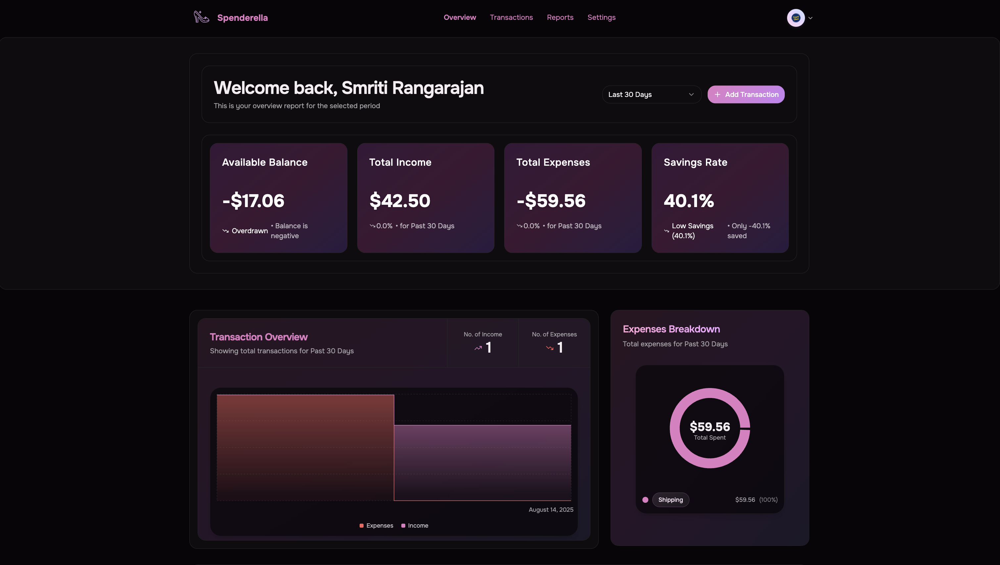

# 👠 Spenderella — Personal Finance Tracker

This is my personal full-stack finance tracker with AI-powered features.  

---

## 📸 Screenshots

### Dashboard

### Transactions

---

## 🗝️ Key Features 👇

- 🔐 **Authentication** — Secure login & registration with JWT.
- 💸 **Create & Edit Transactions** — Track income and expenses.
- 📤 **Upload & Scan Receipts with AI** — Extract transaction details automatically.
- 📈 **Advanced Analytics** — Income vs Expense charts, category breakdowns.
- 📊 **Expenses Breakdown Pie Chart** — Visualize spending.
- 📈 **Income & Expense Line Chart** — Track trends over time.
- 📅 **Filter by Date Range** — Last 7 days, last 30 days, custom range.
- ♻️ **Recurring Transactions** — Automatically repeat bills/income.
- 📄 **Auto-Generated Monthly Reports** — Sent via email.
- 📥 **CSV Transaction Import** — Bulk upload data.
- 🔍 **Filter & Search** — Find exactly what you need.
- 🗑️ **Bulk Delete** — Clear multiple transactions at once.
- ➕ **Duplicate Transactions** — Save time on repeat entries.
- 🧑‍💼 **Profile Photo Upload** — Cloud storage support.
- 🌐 **Built with MERN Stack** — Node.js, MongoDB, React, TypeScript.

## 🛠 Tools I Learned to Use

- **Cron Jobs** — For automating recurring transactions and monthly reports.  
- **Cloudinary** — For secure and efficient cloud storage of profile photos and receipts.  

---
